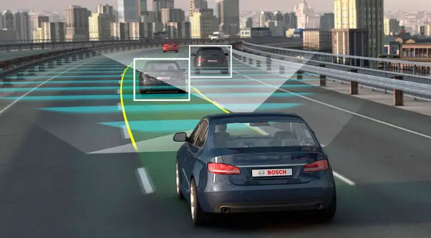
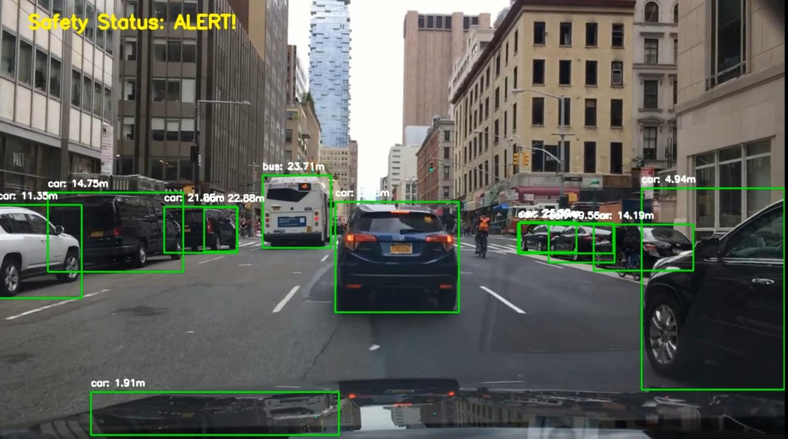
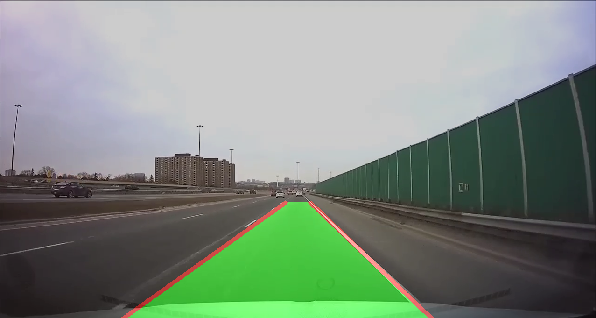
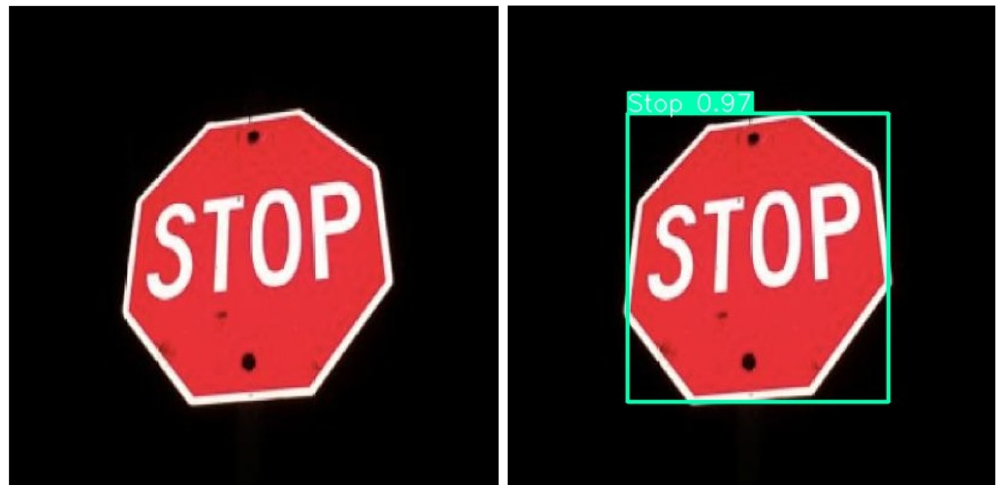
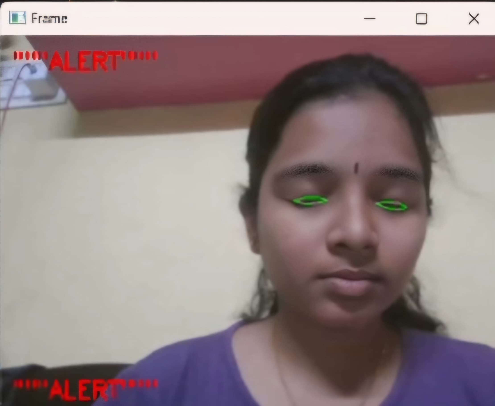

# IntelliDrive-Assist
# 🚗 Advanced Driver Assistance System (ADAS)

An AI-powered, sensor-free ADAS solution for enhancing road safety using real-time vehicle detection, traffic sign recognition, lane detection, and driver drowsiness monitoring — implemented entirely in Python with deep learning models.

---

## 📌 Key Features

- 🔍 **Vehicle Detection & Collision Warning:** YOLOv8 detects vehicles; Apple's Depth Pro estimates inter-vehicle distances.
- 🛑 **Traffic Sign Recognition:** Real-time classification of traffic signs using YOLOv8.
- 🛣️ **Lane Detection:** Ultra-Fast Lane Detection (UFLD) to identify lane boundaries and assist in lane keeping.
- 😴 **Driver Drowsiness Detection:** Detects fatigue using Dlib-based facial landmark tracking and CNN for eye state detection.
- ⚙️ **Real-Time Performance:** Achieves ~25 FPS on Google Colab (Tesla T4 GPU).

---

## 🧠 Tech Stack

| Module                   | Frameworks/Libraries Used         |
|--------------------------|-----------------------------------|
| Object Detection         | YOLOv8, PyTorch, OpenCV           |
| Lane Detection           | UFLD, OpenCV                      |
| Drowsiness Monitoring    | Dlib, TensorFlow, SciPy           |
| Depth Estimation         | Apple Depth Pro (simulated)       |
| Inference Pipeline       | Python, NumPy, Google Colab       |

---

## 📷 Visual Output Examples

| Case | Scenario Description                      | Model Response                                      |
|------|-------------------------------------------|-----------------------------------------------------|
| 1️⃣   | Clear Road with Visible Vehicles          | All vehicles detected with high confidence.         |
| 2️⃣   | Heavy Traffic Conditions                  | Overlapping vehicles tracked with NMS.              |
| 3️⃣   | Nighttime Driving                         | Visibility enhanced; reflective features detected.  |
| 4️⃣   | Rainy Weather with Water Splashes         | Partial occlusion handled with shape consistency.   |

### 🖼️ Output Samples

<h3 align="center">🚗 Vehicle Detection & Collision Warning</h3>

  

<h3 align="center">🛣️ Lane Detection</h3>

  

<h3 align="center">🚧 Traffic Sign Recognition</h3>

  

<h3 align="center">😴 Driver Drowsiness Detection</h3>

  

---

## 📊 Computational Performance

| Module                | Complexity             | Avg Latency (ms) |
|----------------------|------------------------|------------------|
| YOLOv8 Detection      | O(n) per frame         | 15               |
| UFLD Lane Detection   | O(h × w)               | 8                |
| Depth Estimation      | O(k) pixels/frame      | 20               |
| Drowsiness Monitoring | O(m) facial landmarks  | 10               |

---
## 🎤 Project Presentation

You can view our conference presentation slides here:  
[📑 ADAS Project Presentation (Google Drive)](https://drive.google.com/file/d/111kHaJihyEma1fWr3vX19TsWF7VlaGE6/view?usp=drive_link)
